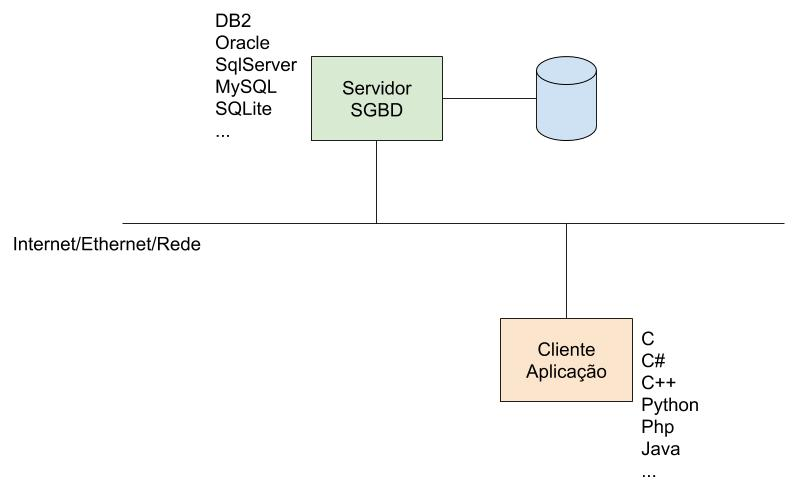

# Acesso Cliente Servidor

O maior problema em se conectar a um banco de dados é que existe MUITOS tipos de banco de dados, por sua vez existem MUITAS linguagens que o cliente pode usar para se conectar.  
Como que uma aplicação em C fala com Oracle?  
Como que uma aplicação em C++ fala com Oracle?  
Como que uma aplicação em Java fala com MySQL?    
Como você pode ver cada linguagem tem que uma maneira de falar com cada um dos banco de dados.  



Claro que pessoas tentaram padronizar essa comunicação, as duas princípais APIs para comunicação são:  
- ODBC (Open Database Connectivity)  
- JDBC (Java Database Connectivity)  

## SQL Embutido
Dentro de uma linguagem de programação ter maneira de fazer requisição SQL a um banco de dados.  
Em outras palavras, é uma maneira de pedir dados ao banco de dados dentro do programa do cliente.  

* comando estático
  * O comando é escrito na linguagem SQL padrão e enviada ao banco de dados.  
    * `SELECT * FROM cliente`
* comando dinâmico
  * Um comando na linguagem passa a string para o banco com a requisição.  

SQL Embutido é uma maneira da aplicação cliente manipular os dados do DB.  

Exemplo de SQL Embutido em Java (comando estático)  
```Java
String DBuser;
#sql {
  SELECT user
    INTO :DBuser
    FROM dual
};
System.out.println("Database username is " + DBuser);
```

banco-05 25:27 slide:Acesso Cliente Servidor
