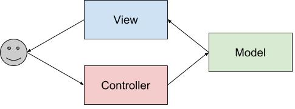

# Camadas
A idéia é separar em camadas para melhor organização, manutenção, flexibilidade, reusabilidade, escalabilidade, etc.  
É normal se separar em 3 camadas:  
- Interface com o usuário
- Lógica de negócio
- Dados

Dois tipos de particionamentos:  
- Particionamento físico
  - Dividir um sistema complexo em varias unidades físicas
- Particionamento lógico
  - Dividir um sistema em módulos, onde cada um tem um objetivo/funcionalidade

Normalmente quem faz o físico também faz o lógico.  

## Particionamento Lógico
Alguns motivo do particionamento lógico:  
- Adicionar características sem ter que reprojetar a aplicação.  
- Modificar lógica de negócio sem afetar os dados ou cliente.  
- Alterar o banco de dados sem afetar a lógica ou cliente.  

A idéia principal é poder alterar cada pate sem afetar a outra.  

## MVC
É a arquitetura de particionamento lógico mais popular atualmente, MVC (model-view-controller).  

- Modelo
  - É a camada responsável por armazenar os dados, valida-los e conferir se seguem as regras dos dados.  
    - Servidor de Banco de Dados.  
- Visão
  - É a camada que interage com o usuário, toda parte que o usuário consegue ver.  
    - Não tem lógica de funcionamento ou navegação.
    - Apenas gera eventos que interagem com o Controlador.  
- Controlador
  - É a camada responsável pela comunicaçaõ entre Modelo e Visão.
    - Passa para a Visão o que ela deve apresentar.
    - Faz pedido de dados ao Modelo.

Vantagens:  
Fácil de manter, testar, atualizar e incrementar o sistema.  

Desvantagens:  
Custa tempo aprender sobre todas as partes, custa tempo entender o relacionamento das camadas e não é aconselhável para ppequenas aplicações.  

## Arquitetura em Camadas

### Uma Camada
Tudo é tratado dentro do mesmo programa, então se você tinha que alterar algo, precisa entender todo o programa para não causar nenhum erro.  
Não é recomendado, era como antigamente os programas eram feitos.  

### Duas Camadas
Dependia do tipo de particionamento utilizado.  

- Particionamento lógico
  - Camada cliente que trata da lógica e da interface
  - Camada servidor que trata dos dados
- Particionamento físico
  - Camada cliente que tratava do desktop
  - Camada servidor que tratava dos dados coporativo

Client <-> DB Server  

Vantagens:  
Bom para aplicações pequenas.  

Desvantagens:  
Atualizar lógica de negócio envolvia cliente ter que atualizar a aplicação dele.  
Muita parte que não interessava ao cliente ficava armazenada com o cliente.   

### Três Camadas

Cliente <-> Application Server <-> DB Server

Vantagens:  
Melhor manutenção, atualizar lógica de negócio não afetar a aplicação do cliente.  
Cliente não precisa saber interagir com varios bancos de dados diferentes.  

Desvantagens:  
Custa mais aprender as ferramentas de cada camada.  

# Pool de Conexões
Como criar uma conexão com um banco de dados custa tempo e memória, podemos escolher manter a conexão enquanto estivermos utilizando ou já deixar pronta para quando precisarmos.  

# SOAP/REST
SOAP: https://en.wikipedia.org/wiki/SOAP  
REST: https://en.wikipedia.org/wiki/Representational_state_transfer
