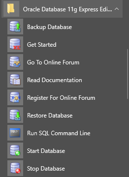

# PUC-INF1341
Banco de Dados 3

# Instalando Oracle Database
Ultima vez que fiz banco de dados 1, eu basicamente recebi um banco de dados pronto e me ensinaram a usar SQL. Quase certeza que nesse caso vai ser parecido...  
Para mim é muito importante saber instalar um banco de dados, pois é o que permite você começar a fazer coisas em casa (em vez de esperar que tenha sempre uma pessoa do suporte instalando para você).  

**Obs**: Eu acho o site da oracle muito bagunçado e aleatório, se um dos links que eu passar tiverem parado de funcionar, você vai ter que se aventurar lá no site (por sorte o site melhorou).  

## Criando conta na Oracle
Para fazer os downloads você vai precisar criar uma conta.  

* https://www.oracle.com/index.html
* Como qualquer outro website, vai ter a opção de criar conta em algum lugar quando você estiver tentando logar.  
  * Geralmente aparece a opção **Sign-in** e no lado **Create Account**.  
* Preencha o formulário
  * Não tem trabalho? Bote **Student**  
  * Não é estudante? Bote **N/A**  
  * Não tem companhia? Bote **N/A**  
  * Bote qualquer coisa mas crie a conta  
* Logue na conta  

## Baixando Oracle Database
* https://www.oracle.com/downloads/index.html
* Vá na categoria **Database**  
* Selecione [**Database 11g Express Edition**](https://www.oracle.com/technetwork/database/database-technologies/express-edition/downloads/index.html)  
  * Versão de graça  
* Aceite a licença
* Clique na versão que deseja baixar e vai começar o download  
  * Se não for **Windows**, esse guia vai ser inútil para tu pois eu estou usando Windows.

## Instalando
Instalando é quase que natural.  

* Descompacte o arquivo onde preferir.  
* Procure o executável **setup.exe** dentro dos arquivos descompactados.  
* Executando ele deve começar uma instalação padrão.  
  * Não lembro de ter feito nada especial na instalação.  

Agora você deve ter o Database instalado e no seu Windows Start Menu:  
  

Agora tudo que eu estou fazendo é seguindo o guia da para **Oracle Database Express Edition**:  
https://docs.oracle.com/cd/E17781_01/admin.112/e18585/toc.htm  
Siga esse guia até terminar a parte 4, isso deve dar o suficiente para poder começar a fazer algo.  

# Conectando com Oracle Database utilizando C#

## Instalando Visual Studio 2017
Talvez outros Visual Studios também funcionem mas como não testei, vou recomendar o único que utilizei.  
* Abrir **Visual Studio Installer**
* Caso já tenha ele instalado clique **Modify**
* Selecione **.NET desktop development**
  * Não sei se precisa do **Universal Windows Platform development**
* Clique install/modify

## Biblioteca para Oracle Database (professor)
Você precisa adicionar a biblioteca com os objetos que conectão com o banco de dados da Oracle no seu projeto.  
* Abra Visual Studio
* Crie um Projeto
  * **File**
  * **New**
  * **Project**
  * Clique em **Visual C#**
  * Selecione **Console Application**
    * Escolha o nome e local que você quiser
* Adicione **System.Data.OracleClient** a referências do projeto
  * Dentro da área **Solution Explorer**
    * Dentro do seu projeto
      * Clique com botão direito em **References**
      * Selecione **Add Reference...**
      * Na barra de busca que está escrita "Search Assemblies" escreva **System.Data.OracleClient**
      * Marque a checkbox na linha do **System.Data.OracleClient**
      * Clique OK
* Escreva **using System.Data.OracleClient** no seu código

## Biblioteca para Oracle Database (stackoverflow)
A que o professor usou parece estar obsoleta:  
https://stackoverflow.com/questions/37727137/how-to-establish-a-oracleconnection-without-making-use-of-the-obsolete-oraclecon  
* Abra Visual Studio
* Crie um Projeto
  * **File**
  * **New**
  * **Project**
  * Clique em **Visual C#**
  * Selecione **Console Application**
    * Escolha o nome e local que você quiser
* Adicione **Oracle.DataAccess** a referências do projeto
  * Dentro da área **Solution Explorer**
    * Dentro do seu projeto
      * Clique com botão direito em **References**
      * Selecione **Add Reference...**
      * Na barra de busca que está escrita "Search Assemblies" escreva **Oracle.DataAccess**
      * Marque a checkbox na linha do **Oracle.DataAccess**
      * Clique OK
* Escreva **using Oracle.DataAccess.Client** no seu código

## x64 bits
Precisa ser rodado utilizando 64bits.  
* Abra Visual Studio
* Clique em **Any CPU**
  * No lado do botão **Play** está o **Any CPU**
* **Configuration Manager**
* Clique em **Any CPU**
  * Em **Active solution platform**
* Selecione **<New...>**
* Bote x64
  * Em **Type or select the new plataform**
* Clique OK
* Clique Close

